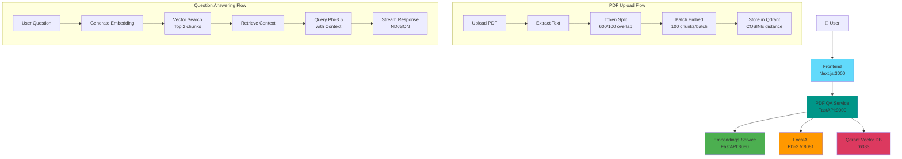

# PDF Q&A Application

AI-powered PDF question answering system built with Next.js, FastAPI, and LocalAI.

## 🚀 Features

- Upload PDF documents
- Ask questions about PDF content
- AI-powered answers using LocalAI
- Vector search with Qdrant
- Modern UI with Next.js & Tailwind CSS

## 🛠️ Tech Stack

### Frontend
- Next.js 15
- TypeScript
- Tailwind CSS

### Backend
- FastAPI (Python)
- Qdrant (Vector Database)
- LocalAI (AI Model Inference - Phi-3.5-mini-instruct)
- pdfplumber (PDF Processing)
- langchain-text-splitters (Token-based text splitting)
- aiohttp (Async HTTP client)

## 📦 Local Setup

### Prerequisites
- Docker & Docker Compose
- 8GB RAM minimum

### Installation

1. Clone the repository
```bash
git clone https://github.com/YOUR-USERNAME/pdf-reader.git
cd pdf-reader
```

2. Set up AI models directory
```bash
mkdir -p models
```

> **Note:** Models are large files (not included in repo). They will be auto-downloaded on first run, or you can manually download from:
> - Embedding models: Auto-downloaded via langchain-huggingface
> - LocalAI models: Place your model files in `models/` folder

3. Start services
```bash
docker-compose up --build
```

3. Access the application
- Frontend: http://localhost:3000
- Embeddings API: http://localhost:8080/docs
- PDF QA API: http://localhost:9000/docs

## 🏗️ Architecture



**RAG Flow:**
1. PDF Upload → Text Extraction → Token Splitting (600 tokens, 100 overlap)
2. Batch Embedding (100 chunks/batch) → Store in Qdrant
3. Question → Embedding → Vector Search (COSINE similarity, top 2)
4. Retrieved Context + Question → Phi-3.5 Model → Streaming Response

## 📁 Project Structure

```
pdf-reader/
├── frontend/           # Next.js frontend
├── backend/
│   ├── embeddings/    # Embeddings service
│   └── pdfqa/         # PDF processing service
└── docker-compose.yml
```

## 📡 API Endpoints

### PDF QA Service (Port 9000)

**POST /upload**
- Upload PDF file
- Extracts text, splits into chunks, generates embeddings
- Stores in Qdrant vector database
- Returns: `{pdf_id, message, stats: {chunks}}`

**POST /ask**
- Ask questions about uploaded PDFs
- Request: `{question: str, pdf_id: str (optional), chat_history: []}`
- Response: NDJSON streaming format
  ```json
  {"type": "metadata", "pdf_id": "pdf_xxx", "sources": [{"chunk_id": 0}]}
  {"type": "chunk", "content": "partial answer..."}
  {"type": "chunk", "content": "more text..."}
  ```

**GET /pdfs**
- List all uploaded PDF collections
- Returns: `{pdfs: [{id, name}]}`

**GET /pdfs/{pdf_id}/chunks/{chunk_id}**
- Retrieve specific chunk text for citation
- Returns: `{chunk_id, text, metadata}`

**GET /health**
- Health check endpoint
- Returns: `{status: "healthy"}`

### Embeddings Service (Port 8080)

**POST /embed**
- Generate embedding for single text
- Request: `{text: str}`
- Returns: `[float]` (384-dim vector)

**POST /embed_batch**
- Generate embeddings for multiple texts
- Request: `{texts: [str]}`
- Returns: `[[float]]`

**GET /health**
- Health check endpoint

## 🚀 Deployment

See deployment guides for:
- Vercel (Frontend)
- Render (Backend)

## 📄 License

MIT
