# 🤖 PDF Q&A Application

> AI-powered document assistant that lets you chat with your PDFs using RAG and local LLM inference

[](https://nextjs.org/)
[](https://reactjs.org/)
[](https://fastapi.tiangolo.com/)
[](https://www.docker.com/)
[](https://localai.io/)
[](LICENSE)

[🚀 Live Demo](#) | [📹 Video Demo](#) | [📧 Contact](#-contact)

---

## 📸 Demo

> **Note:** live demo area


_Upload any PDF and ask questions - get AI-powered answers with source citations_

---

## 💡 About This Project

Built to demonstrate **end-to-end AI/ML engineering capabilities**, from PDF processing and vector embeddings to LLM integration and real-time streaming responses. This project showcases production-ready architecture with Docker orchestration, microservices design, and modern full-stack development practices.

**Key Problem Solved:** Traditional PDF readers are static. This application makes PDFs interactive by allowing natural language queries, powered by Retrieval Augmented Generation (RAG) for accurate, context-aware answers.

---

## ✨ Key Highlights

- 🎯 **Full RAG Pipeline Implementation**: Custom-built retrieval system with intelligent chunking, semantic embeddings, and vector similarity search
- ⚡ **Optimized Performance**: Batch embedding processing (100 chunks/batch), COSINE similarity search, and real-time streaming responses
- 🏗️ **Microservices Architecture**: 4 containerized services with health checks, dependency management, and graceful startup
- 🔒 **Local-First AI**: Runs entirely on your machine using LocalAI - no API keys, no external dependencies, complete privacy
- 📊 **Real-Time Streaming**: NDJSON streaming protocol for live answer generation with source citations
- 🎨 **Modern UI/UX**: Responsive Next.js interface with TypeScript, Tailwind CSS, and React 19

---

## 🚀 Features

- Upload PDF documents
- Ask questions about PDF content
- AI-powered answers using LocalAI
- Vector search with Qdrant
- Modern UI with Next.js & Tailwind CSS

## 🛠️ Tech Stack

### Frontend

- Next.js 16.1
- React 19.2
- TypeScript 5
- Tailwind CSS

### Backend

- FastAPI (Python)
- Qdrant (Vector Database)
- LocalAI (AI Model Inference - Phi-3.5-mini-instruct)
- pdfplumber (PDF Processing)
- langchain-text-splitters (Token-based text splitting)
- aiohttp (Async HTTP client)

## 📦 Local Setup

### Prerequisites

- Docker & Docker Compose
- 8GB RAM minimum

### Installation

1. Clone the repository

```bash
git clone https://github.com/YOUR-USERNAME/pdf-reader.git
cd pdf-reader
```

2. Set up AI models directory

```bash
mkdir -p models
```

> **Note:** Models are large files (not included in repo). They will be auto-downloaded on first run, or you can manually download from:
>
> - Embedding models: Auto-downloaded via langchain-huggingface
> - LocalAI models: Place your model files in `models/` folder

3. Start services

```bash
docker-compose up --build
```

3. Access the application

- Frontend: http://localhost:3000
- Embeddings API: http://localhost:8080/docs
- PDF QA API: http://localhost:9000/docs
- LocalAI: http://localhost:8081/v1/models
- Qdrant Dashboard: http://localhost:6333/dashboard

> **⏱️ First Startup Note:** Initial startup may take 10-30 minutes as models are downloaded (2-4GB). Check Docker logs to monitor progress:
>
> ```bash
> docker-compose logs -f embeddings localai
> ```

### Environment Variables

The following environment variables are configured in `docker-compose.yml`:

**PDF QA Service:**

- `EMBEDDINGS_SERVICE_URL`: URL for embeddings service (default: `http://embeddings:8080`)
- `QDRANT_HOST`: Qdrant vector database host (default: `qdrant`)
- `QDRANT_PORT`: Qdrant port (default: `6333`)
- `LOCALAI_URL`: LocalAI API endpoint (default: `http://localai:8080/v1`)

**LocalAI Service:**

- `MODELS_PATH`: Directory for AI models (default: `/models`)
- `LOG_LEVEL`: Logging level (default: `INFO`)

### Development Setup (Without Docker)

**Prerequisites:**

- Python 3.10+
- Node.js 20+
- Qdrant running locally or via Docker

**Backend Services:**

```bash
# Embeddings Service
cd backend/embeddings
pip install -r requirements.txt
uvicorn app.main:app --reload --port 8080

# PDF QA Service
cd backend/pdfqa
pip install -r requirements.txt
export EMBEDDINGS_SERVICE_URL=http://localhost:8080
export QDRANT_HOST=localhost
export LOCALAI_URL=http://localhost:8081/v1
uvicorn app.main:app --reload --port 9000
```

**Frontend:**

```bash
cd frontend
npm install
npm run dev
```

## 🏗️ Architecture

```mermaid
graph TB
    User[👤 User] --> Frontend[Frontend<br/>Next.js:3000]
    Frontend --> PDFQA[PDF QA Service<br/>FastAPI:9000]

    PDFQA --> Embeddings[Embeddings Service<br/>FastAPI:8080]
    PDFQA --> LocalAI[LocalAI<br/>Phi-3.5:8081]
    PDFQA --> Qdrant[Qdrant Vector DB<br/>:6333]

    subgraph "PDF Upload Flow"
        U1[Upload PDF] --> U2[Extract Text]
        U2 --> U3[Token Split<br/>600/100 overlap]
        U3 --> U4[Batch Embed<br/>100 chunks/batch]
        U4 --> U5[Store in Qdrant<br/>COSINE distance]
    end

    subgraph "Question Answering Flow"
        Q1[User Question] --> Q2[Generate Embedding]
        Q2 --> Q3[Vector Search<br/>Top 2 chunks]
        Q3 --> Q4[Retrieve Context]
        Q4 --> Q5[Query Phi-3.5<br/>with Context]
        Q5 --> Q6[Stream Response<br/>NDJSON]
    end

    style Frontend fill:#61dafb
    style PDFQA fill:#009688
    style Embeddings fill:#4caf50
    style LocalAI fill:#ff9800
    style Qdrant fill:#dc395f
```



**RAG Flow:**

1. PDF Upload → Text Extraction → Token Splitting (600 tokens, 100 overlap)
2. Batch Embedding (100 chunks/batch) → Store in Qdrant
3. Question → Embedding → Vector Search (COSINE similarity, top 2)
4. Retrieved Context + Question → Phi-3.5 Model → Streaming Response

## 📁 Project Structure

```
pdf-reader/
├── frontend/           # Next.js frontend
├── backend/
│   ├── embeddings/    # Embeddings service
│   └── pdfqa/         # PDF processing service
└── docker-compose.yml
```

## 📡 API Endpoints

### PDF QA Service (Port 9000)

**POST /upload**

- Upload PDF file
- Extracts text, splits into chunks, generates embeddings
- Stores in Qdrant vector database
- Returns: `{pdf_id, message, stats: {chunks}}`

**POST /ask**

- Ask questions about uploaded PDFs
- Request: `{question: str, pdf_id: str (optional), chat_history: []}`
- Response: NDJSON streaming format
  ```json
  {"type": "metadata", "pdf_id": "pdf_xxx", "sources": [{"chunk_id": 0}]}
  {"type": "chunk", "content": "partial answer..."}
  {"type": "chunk", "content": "more text..."}
  ```

**GET /pdfs**

- List all uploaded PDF collections
- Returns: `{pdfs: [{id, name}]}`

**GET /pdfs/{pdf_id}/chunks/{chunk_id}**

- Retrieve specific chunk text for citation
- Returns: `{chunk_id, text, metadata}`

**GET /health**

- Health check endpoint
- Returns: `{status: "healthy"}`

### Embeddings Service (Port 8080)

**POST /embed**

- Generate embedding for single text
- Request: `{text: str}`
- Returns: `[float]` (384-dim vector)

**POST /embed_batch**

- Generate embeddings for multiple texts
- Request: `{texts: [str]}`
- Returns: `[[float]]`

**GET /health**

- Health check endpoint

## 🚀 Deployment

This project uses a **privacy-first architecture** with LocalAI, which requires significant compute resources (4-8GB RAM, GPU recommended). For cost-effective deployment:

### Frontend Deployment (Vercel) - UI Preview

Deploy the Next.js frontend to showcase the interface and architecture:

```bash
cd frontend
vercel deploy
```

See **[DEPLOYMENT.md](DEPLOYMENT.md)** for complete step-by-step instructions.

### Backend (Local Development Only)

The full backend stack (FastAPI, LocalAI, Qdrant, Vector embeddings) runs locally for:

- **Privacy**: All data processing stays on your machine - no external API calls
- **Cost-Effective**: Avoid expensive cloud GPU/compute costs ($50-100/month)
- **Full Control**: Complete control over models, data, and processing

### 📹 Video Demo

The complete functionality is demonstrated via video walkthrough. See **[VIDEO_DEMO_GUIDE.md](VIDEO_DEMO_GUIDE.md)** for recording instructions.

> **Cloud Deployment Note:** For production cloud deployment, consider replacing LocalAI with OpenAI/Anthropic/Hugging Face APIs. LocalAI excels for local development and privacy-sensitive applications but requires expensive GPU infrastructure for cloud hosting.

---

## 🐛 Troubleshooting

### Long Startup Times

**Problem:** Services take 10-30 minutes to start
**Solution:** Models are being downloaded (2-4GB). Monitor progress:

```bash
docker-compose logs -f embeddings localai
```

For faster subsequent starts, models are cached in the `models/` directory.

### Out of Memory Errors

**Problem:** Docker containers crash with OOM
**Solution:** Increase Docker memory allocation to at least 8GB in Docker Desktop settings.

### PDF Upload Fails

**Problem:** Large PDFs fail to upload
**Solution:**

- Check PDF size (recommended < 50MB)
- Ensure sufficient disk space for text extraction
- Check Docker logs: `docker-compose logs pdfqa`

### Qdrant Connection Errors

**Problem:** "Cannot connect to Qdrant"
**Solution:**

- Ensure Qdrant service is healthy: `docker-compose ps`
- Wait for all health checks to pass (may take 2-5 minutes)
- Restart services: `docker-compose restart pdfqa`

### LocalAI Model Not Found

**Problem:** "Model not found" or "Failed to load model"
**Solution:**

- Ensure `models/` directory exists and has proper permissions
- Check LocalAI logs: `docker-compose logs localai`
- Manually download Phi-3.5 model if auto-download fails

### Slow Inference Times

**Problem:** Questions take too long to answer
**Solution:**

- LocalAI runs on CPU by default (5-15 seconds per response)
- For GPU acceleration, update docker-compose.yml with CUDA support
- Reduce context chunks from 2 to 1 in the code for faster responses

---

## 📊 Performance Metrics

- **PDF Processing**: ~10-20 seconds for 100-page PDF
- **Question Response**: 5-15 seconds (CPU inference)
- **Embedding Generation**: ~1 second per 100 chunks
- **Vector Search**: < 100ms for similarity search
- **Max PDF Size**: 50MB recommended (tested up to 200 pages)
- **Token Limit**: 600 tokens per chunk, 100 token overlap

---

## 🔒 Security Considerations

- **Local-First**: All data stays on your machine - no external API calls
- **CORS**: Currently configured for development (`*`). Restrict in production.
- **No Authentication**: Add authentication layer for production deployments
- **Input Validation**: PDF size limits and text sanitization implemented
- **Docker Isolation**: Services run in isolated containers with no host network access

---

## 🎯 Known Limitations

- CPU-based inference (slower than GPU)
- No support for scanned PDFs (OCR not implemented)
- Context window limited to top 2 chunks (can be increased)
- Single-user design (no multi-tenancy)
- Models require 4-6GB disk space

---

## 🤝 Contributing

Contributions are welcome! Areas for improvement:

- GPU acceleration support
- OCR for scanned PDFs
- User authentication system
- Multi-language support
- Chat history persistence
- Export chat conversations
- Support for DOCX, TXT file uploads

---

## 📞 Contact

**Built by:** Sai Krishna
**LinkedIn:** [https://www.linkedin.com/in/saikrishna01301/]
**Portfolio:** I will add later

## 💼 **Open to opportunities**

In Full-Stack Development, AI Engineering.

## 📄 License

MIT License - feel free to use this project for learning or building your own applications!

---

### ⭐ If you found this project helpful, please star the repository!
